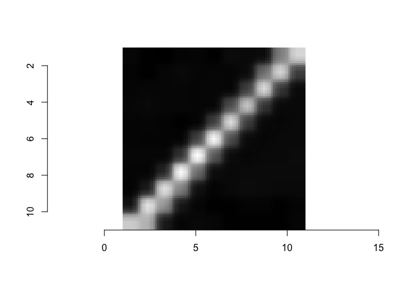
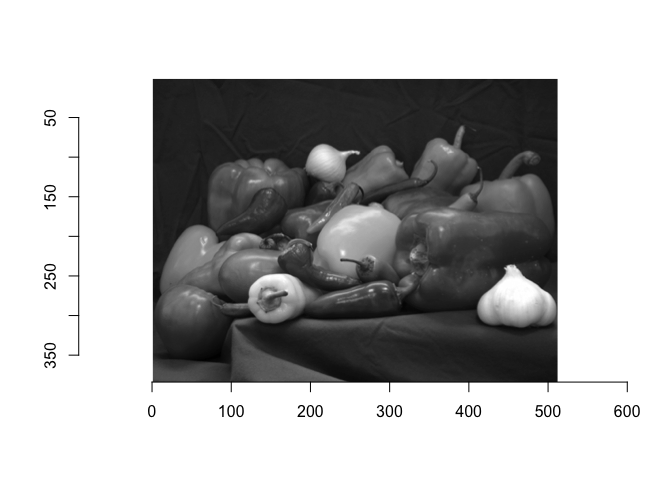
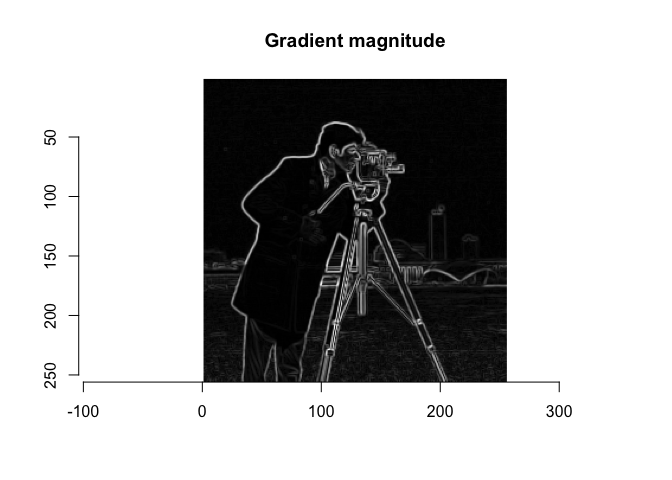
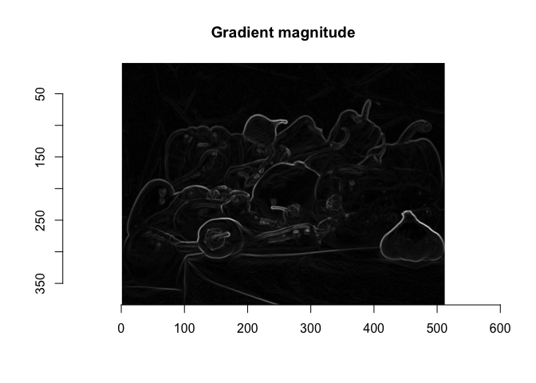

---
title: Image Processing Fundamentals
layout: single
author: Jennifer Chang
author_profile: true
header:
  overlay_color: "444444"
  overlay_image: /assets/images/margaret-weir-GZyjbLNOaFg-unsplash_dark.jpg
---


**Last Update:** 14 Jan 2021 <br /> **RMarkdown:**
[R\_Image\_Processing.Rmd](https://geospatial.101workbook.org/tutorials/R_Image_Processing.Rmd)

## Overview

In this tutorial, we present a brief overview of image processing
concepts necessary to understand machine learning and deep learning.
This walk through was originally written in python: [link to python
version](https://geospatial.101workbook.org/Workshops/Tutorial1_Image_Processing_Essentials_Boucheron.html).
We have tried to maintain functionality across both languages but
certain libraries/features may only be available in one or the other.
The basics of image processing should be the same across both.

This tutorial explores:

-   Loading image files into R
-   Printing properties of an image
-   Converting an image between color and grayscale
-   Identifying features (edges) within an image

## Downloading Images

<!-- TODO: replace these with landsat images. This should be a geospatial tutorial. -->

We will be using two images which can be downloaded from the following
links:

-   [cameraman.png](https://geospatial.101workbook.org/Workshops/Tutorial1_Image_Processing_Essentials_Boucheron.html)
-   [peppers.png]()

|                                cameraman.png                                |                                peppers.png                                |
|:---------------------------------------------------------------------------:|:-------------------------------------------------------------------------:|
|  |  |

From a terminal, we could have used the `wget` or `curl` commands to
download the images.

``` bash
wget https://geospatial.101workbook.org/tutorials/data/cameraman.png
wget https://geospatial.101workbook.org/tutorials/data/peppers.png

ls -1 *.png
#> cameraman.png
#> peppers.png
```

The `cameraman.png` on the left is in grayscale and the `peppers.png` on
the right is in color. Processing color or grayscale images is slightly
different, which we will explore in the following tutorial.

## Loading images into R

We will assume you have a working R environment; however, see the
following for a tutorial on setting up an R environment:

-   [Set up R and R
    Environment](https://bioinformaticsworkbook.org/dataWrangling/R/r-setup.html#gsc.tab=0)

The nice thing about scripting languages is the fact that many tools are
published as libraries. Which means you do not have to write your own
functions from scratch. For this tutorial, we will be using R’s `imager`
library available on CRAN ([link to more
info](http://dahtah.github.io/imager/)). There may be other image
libraries more suited to your analysis, and we highly encourage you to
explore, especially as new libraries are constantly being developed.

Below, we can install and load the `imager` library.

``` r
# install.packages("imager")       # <= uncomment to install from CRAN
library(imager)
```

From there, we can use the `load.image` function to read in
`cameraman.png`. You may need the path to your input file, if they are
not in the same location.

``` r
I_camera = load.image('data/cameraman.png')   # <= path to input image here
plot(I_camera)
```

<!-- -->

Here, we have read in the image and stored it as `I_camera`. To verify
that the image was successfully loaded into R, we have displayed the
image using the `plot` function.

From the plot, notice how the x-axis goes from 0 to 300 from left to
right. Strangely, the y-axis goes from 0 to 300, top to bottom.
Therefore, the xy point (0,0) is actually the **top left** of the image.
This can be very important **as your analysis results may be different
if the (0,0) is top left, right, bottom, or center**. It’s a good idea
to check where (0,0) is in the image.

Now, we can also load the `peppers.png` in the same way, and store it as
`I_peppers`.

``` r
I_peppers = load.image('data/peppers.png')   # <= path to input image here
plot(I_peppers)
```

<!-- -->

## Properties of an image

Now that we’ve loaded and plotted the images. What is an image object
and its properties?

An image is actually stored as a matrix of pixels, usually stored in
multiple layers. The diagram from
<https://media.geeksforgeeks.org/wp-content/uploads/Pixel.jpg> is a good
illustration of the concept of image layers.


From R, we can look at the structure (`str`) of a variable (`I_camera`)
by the following:

``` r
str(I_camera)
#>  'cimg' num [1:256, 1:256, 1, 1] 0.612 0.624 0.62 0.608 0.62 ...
```

The structure of `I_camera` is an array of numbers
`cimg num [1:256, 1:256, 1, 1]`. This is showing the dimension of the
images to be 256 pixels wide, 256 pixels high, with 1 depth (layer), and
1 channel (because it’s a grayscale image).

Now, let’s look at `I_peppers`, which is a color image. How is the
structure different?

``` r
str(I_peppers)
#>  'cimg' num [1:512, 1:384, 1, 1:3] 0.243 0.247 0.247 0.255 0.259 ...
```

Other then a 512 pixel width and 384 pixel height, notice how the 4th
term is `1:3` which indicates three channels (RGB or Red Green Blue).

We could have also used the dimension (`dim`) function to quickly
compare them.

``` r
dim(I_camera)        # Width_in_pixels Height_in_pixels Depth(layers) color(1=grayscale, 3=RGB)
#> [1] 256 256   1   1
dim(I_peppers)
#> [1] 512 384   1   3
```

## Subregions of the image

Since an image object is really an R matrix, the matrix sub setting
functions work to subset an image. Here, we pull out a subregion near
the center of the image (100 to 110 pixels high and wide) and store it
as `sub_I_camera`

``` r
sub_I_camera = as.cimg(I_camera[100:110,100:110,,] )
plot(sub_I_camera)
```

<!-- -->

From this smaller `sub_I_camera`, we can print out the pixel values, get
the minimum value and maximum value.

``` r
sub_I_camera[,,,1]
#>             [,1]       [,2]       [,3]       [,4]       [,5]       [,6]
#>  [1,] 0.04705882 0.03921569 0.04313725 0.04705882 0.04313725 0.04313725
#>  [2,] 0.03529412 0.03529412 0.04705882 0.05098039 0.04313725 0.03921569
#>  [3,] 0.03137255 0.04313725 0.04705882 0.04705882 0.03921569 0.03921569
#>  [4,] 0.03921569 0.05098039 0.04705882 0.04705882 0.03529412 0.03921569
#>  [5,] 0.04313725 0.04313725 0.04313725 0.04313725 0.03921569 0.27843137
#>  [6,] 0.03529412 0.04313725 0.04705882 0.04705882 0.27058824 0.78431373
#>  [7,] 0.06666667 0.04313725 0.04313725 0.32156863 0.71372549 0.31764706
#>  [8,] 0.05098039 0.06274510 0.27058824 0.65882353 0.26274510 0.05882353
#>  [9,] 0.06666667 0.41568627 0.70980392 0.23529412 0.05490196 0.04705882
#> [10,] 0.46274510 0.69803922 0.24313725 0.05490196 0.04705882 0.05490196
#> [11,] 0.69803922 0.26666667 0.05882353 0.05098039 0.05490196 0.05490196
#>             [,7]       [,8]       [,9]      [,10]      [,11]
#>  [1,] 0.04705882 0.04313725 0.03921569 0.10196078 0.67058824
#>  [2,] 0.04705882 0.04313725 0.13333333 0.72941176 0.60392157
#>  [3,] 0.04705882 0.18039216 0.72549020 0.52941176 0.12941176
#>  [4,] 0.22745098 0.78823529 0.47843137 0.11764706 0.04313725
#>  [5,] 0.80000000 0.41568627 0.09019608 0.04313725 0.05098039
#>  [6,] 0.35686275 0.07058824 0.03921569 0.03529412 0.04705882
#>  [7,] 0.06666667 0.05490196 0.05490196 0.03529412 0.03529412
#>  [8,] 0.04705882 0.06274510 0.06666667 0.03921569 0.03529412
#>  [9,] 0.05490196 0.05882353 0.06274510 0.03921569 0.03529412
#> [10,] 0.05490196 0.06274510 0.05098039 0.03529412 0.03529412
#> [11,] 0.06666667 0.06274510 0.05098039 0.03921569 0.04313725
min(sub_I_camera[,,,1])
#> [1] 0.03137255
max(sub_I_camera[,,,1])
#> [1] 0.8
```

See if you can subset and explore the `I_peppers` color image. Try to
pull out a subimage that only contains one pepper.

## Convert to Color Images to Grayscale

There are many reasons why we might want to convert a color image to a
grayscale image. For one thing, it results in a reduction in image size
(drop the 3 channels into 1). Another reason, is we want to focus on one
color to identify an object in a busy scene. Or we may want to flatten
certain layers to better identify edges of an object of interest.

Recall the `I_peppers` color image?

``` r
I_peppers = load.image('data/peppers.png')       # <= path to peppers.png
plot(I_peppers)
```

<!-- -->

The `imager` package provides a convenient `grayscale` function.

``` r
gray_I_peppers = grayscale(I_peppers)
plot(gray_I_peppers)
```

<!-- -->

Recall that an image is really a matrix of numbers. Let’s compare the
dimensions of the original with the new image.

``` r
dim(I_peppers)          # Color Original
#> [1] 512 384   1   3
dim(gray_I_peppers)     # Grayscale Transformed
#> [1] 512 384   1   1
```

The only difference should be the 4th entry.

## Identify edge features in an image.

In order to identify objects in an image, it is often necessary to
identify edges. While humans can intuitively identify edges to an
object, computational edge detection is a bit more noisy. Usually it
involves defining some gradiant function. An example shown below:

``` r
dx <- imgradient(I_camera, "x")
dy <- imgradient(I_camera, "y")
grad.mag <- sqrt(dx^2 + dy^2)
plot(grad.mag, main="Gradient magnitude")
```

<!-- -->

This particular function is called a Sobal Filter. To read more about
Sobal filters, see this link: [wikipedia - sobel
operator](https://en.wikipedia.org/wiki/Sobel_operator)

What happens if we identify edges in the color image `I_peppers`?

``` r
dx <- imgradient(I_peppers, "x")
dy <- imgradient(I_peppers, "y")
grad.mag <- sqrt(dx^2 + dy^2)
plot(grad.mag, main="Gradient magnitude")
```

<!-- -->

What happens if we convert the color image to a gray scale image first?

``` r
gray_I_peppers = grayscale(I_peppers)
dx <- imgradient(gray_I_peppers, "x")
dy <- imgradient(gray_I_peppers, "y")
grad.mag <- sqrt(dx^2 + dy^2)
plot(grad.mag, main="Gradient magnitude")
```

<!-- -->

# In Summary

Hopefully, you have learned how to:

-   load image files into R,
-   identify the dimensions of the image (gray vs color),
-   learned some common transformations (pull out subregions, convert to
    grayscale),
-   and identify edge features.

These colors and features can be fed into Machine Learning algorithms
for image recognition such as but not limited to identifying roadways,
forest cover, and snow cover. Hopefully, this has provided you with some
intuition on how to perform analysis/transformations on image files.
