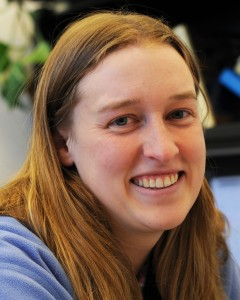

### Andrew Severin

{: .align-left}
His PhD was in Biophysics/NMR spectroscopy. He did a Bioinformatics Postdoc in Soybean genetics and now runs the Genome Informatics Facility at Iowa State University.

### Kerrie Geil

{: .align-left-profile }
Kerrie is an ARS SCINet postdoc in the research group of Dr. Deb Peters in Las Cruces, NM. Her M.S. and Ph.D. degrees are in Atmospheric Sciences and her research background is in climate modeling.
<!--
Kerrie served as a AAAS Policy Fellow at USDA ARS in Beltsville MD from 2018-2020 and has recently transitioned in July to a SCINet Postdoc position in Las Cruces, NM in the research group of Dr. Deb Peters. She received her PhD in Atmospheric Sciences from the University of Arizona in 2016 and her research background is in global and regional climate modeling and climate model performance evaluation using in-situ and satellite observations. Kerrie has expertise in global-, continental-, and regional- scale climate dynamics including teleconnections/climate oscillations (ENSO, PDO, etc.), land-atmosphere-ocean interactions, and the North American Monsoon system. She has also worked on national- and local- scale extreme temperature projects. One of the projects Kerrie hopes to accomplish during her time as a postdoc at ARS is a climate model evaluation tool to make the process of model ensemble selection (e.g. which downscaled models should be excluded from your analyses due to the garbage in garbage out principle) simpler and quicker for research scientists.-->

### Rowan Gaffney
{: .align-left-profile }
Rowan Gaffney is the Remote Sensing Specialist in the Rangeland Resource & Systems Research Unit at Fort Collins, CO.

### Laura Boucheron

{: .align-left-profile }
Laura E. Boucheron received the B.S. and M.S. degrees in electrical engineering from New Mexico State University, Las Cruces, in 2001 and 2003, respectively, and the Ph.D. degree in electrical and computer engineering from the University of California, Santa Barbara, in 2008. She has intern and graduate research experience at both Sandia National Laboratories and Los Alamos National Laboratory and postdoctoral and research faculty experience in the Klipsch School of Electrical and Computer Engineering at New Mexico State University. She is currently an Associate Professor in the Klipsch School. Her teaching interests include signals & systems, digital signal processing, digital image processing, and pattern recognition and machine learning. Her research interests include image analysis, feature extraction, pattern recognition and machine learning, temporal image analysis, interdisciplinary research, solar image analysis, and biomedical image analysis.

### Suzy Stillman

{: .align-left-profile }
Suzy is an ARS SCINet postdoc in the research group of Dr. Deb Peters in Las Cruces, NM. Her M.S. and Ph.D. degrees are in Hydrometeorology and her research background is in hydrologic observations and projections.

<!--Suzy began working as a SCINet Postdoc in Las Cruces, NM in Dr. Deb Peters’ research group in July, 2020. After receiving her PhD in hydrometeorology from the University of Arizona, she worked at the Desert Research Institute in Las Vegas, NV, where her main research focus included climate analyses for DoD and DoE. Her background is in evaluating and improving the hydrologic observing system through combining data from a variety of sources. Some of her research that excites her most includes working towards understanding the impact of atmospheric rivers on Colorado River yield and the influence of topography on precipitation in the western US. Her research interests include making the best use of the already available suite of hydrologic observational data to gain a better understanding of the future hydroclimate.-->

### Jennifer Chang

{: .align-left-profile }
Her PhD was in Bioinformatics and Computational Biology with a minor in Statistics. During her PhD, she developed the C++ software Mango Graph Studio which has been licensed to a startup. Since then, she has worked on automating the Influenza A Virus in Swine reports and recently has been designing Nextflow pipelines for highly scalable and reproducible pipelines. She enjoys designing workflows to reduce tedium and increase joy of discovery.
